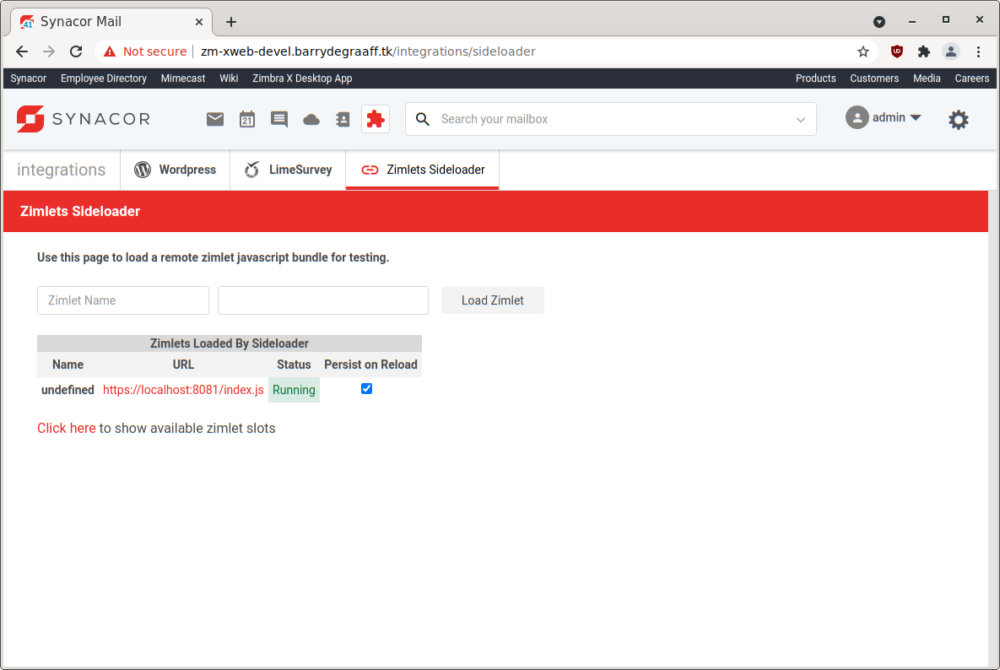
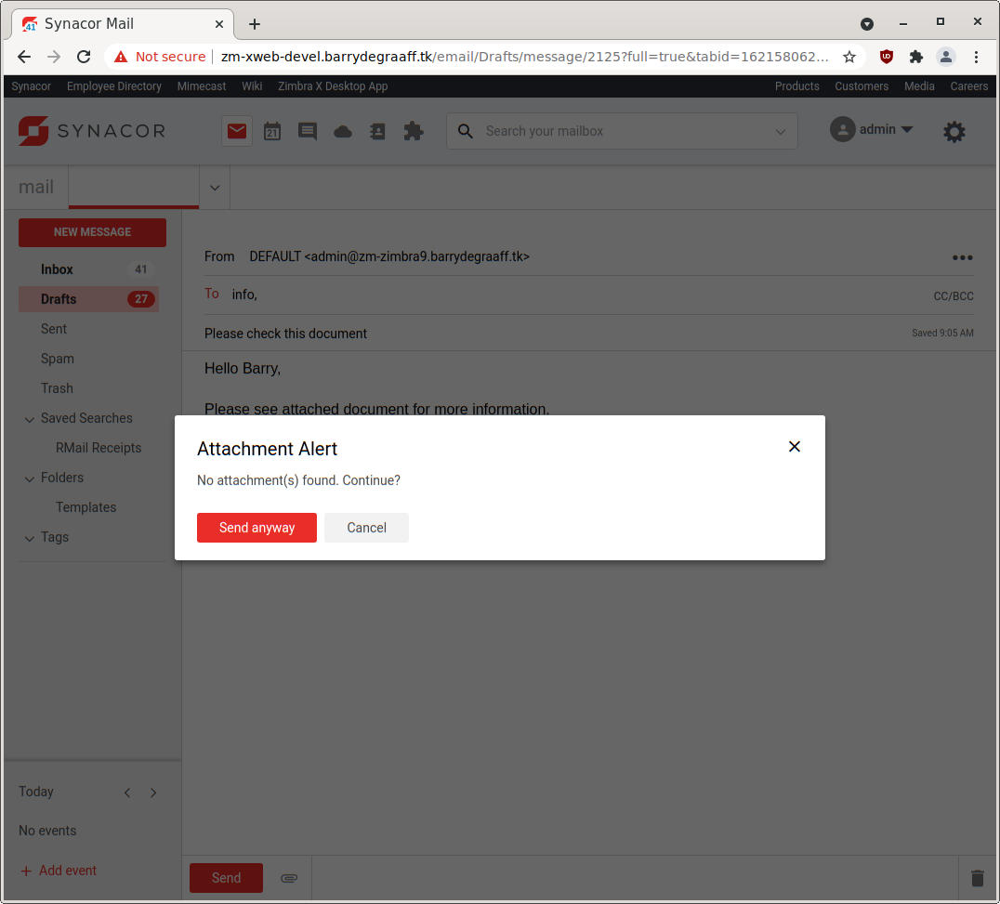

# Listen for events using a Zimlet

This article explains how to write a Zimlet that listens for an event using zimletEventEmitter. This way you can write for example an Attachment Alert Zimlet. The Attachment Alert Zimlet can register an event listener that is fired when the user clicks the Send button when writing an email. Then the Zimlet can look in the body of the email and look for words like `attached` and in case no attachment is uploaded it can show the user a reminder for uploading the attachment.

## Downloading and running the Attachment Alert Zimlet

Create a folder on your local computer to store the Attachment Alert Zimlet:

      mkdir ~/zimbra_course_pt16
      cd ~/zimbra_course_pt16
      git clone https://github.com/Zimbra/zimbra-zimlet-attachment-alert
      cd zimbra-zimlet-attachment-alert
      npm install
      zimlet watch

The output of this command should be:

```
Compiled successfully!

You can view the application in browser.

Local:            https://localhost:8081/index.js
On Your Network:  https://192.168.1.100:8081/index.js
```

Visit https://localhost:8081/index.js in your browser and accept the self-signed certificate. The index.js is a packed version of the `Attachment Alert Zimlet`. More information about the zimlet command, npm and using SSL certificates can be found in https://github.com/Zimbra/zm-zimlet-guide. 

Have you already used Zimlet Cli in the past? Make sure to update it using `sudo npm install -g @zimbra/zimlet-cli`. You can check your version using `zimlet --version`. You will need version `12.8.0` of Zimlet Cli for this Zimlet to work.

## Sideload the Attachment Alert Zimlet

Log on to your Zimbra development server and make sure that you are seeing the modern UI. Then click the Jigsaw puzzle icon and Zimlets Sideloader. If you are not seeing the Zimlet Sideloader menu. You have to run `apt/yum install zimbra-zimlet-sideloader` on your Zimbra server and enable the Sideloader Zimlet in your Class of Service.

> 
*Sideload the Attachment Alert Zimlet by clicking Load Zimlet. The Zimlet is now added to the Zimbra UI in real-time. No reload is necessary.*

Write a new email and put something like `Please see attached document for more information.` in the body of the email. Do not attach a file and click Send. You will then see the new Attachment Alert Zimlet in action.

> 
*The Attachment Alert*

## zimletEventEmitter events 

Zimlets can register listeners that are provided via zimletEventEmitter. The following events are supported:

- LOGOUT
- ONSEND
- ONSENDINVITEREPLY

_New events will be added to Zimbra soon, this guide will be updated when that happens._

The `LOGOUT` event is fired when the user clicks the `Logout` menu item. It can be used to trigger a log-out in non Single Log Out aware 3rd party application.

The `ONSEND` event is fired when the user clicks the `Send` button when sending an email. It can be used for email error checks, such as a forgotten attachment reminder, or do a check in a 3rd party application for compliance validation.

The `ONSENDINVITEREPLY` is fired when a user RSVP's to a calendar invitation. The `verb` and `invitation` are passed to the event handler. You can use the `verb` to determine if the user accepted, declined, proposed a new time or tentatively accepted the invitation. Define your handler like: `onSendHandler = (args) => {console.log(args);}`.

There can be two types of handlers.

1. Handler doing synchronous tasks like - calculating something, displaying toast, or updating view/state. Here is an example of this kind of handler:
```
import { zimletEventEmitter } from '@zimbra-client/util';
import { ZIMBRA_ZIMLET_EVENTS } from '@zimbra-client/constants';

const onLogoutHandler = () => { /** Display toast message */ };
zimletEventEmitter.on(ZIMBRA_ZIMLET_EVENTS.LOGOUT, onLogoutHandler);
```

2. Handler doing asynchronous tasks like - invoke an API call or display a dialog to confirm the action with the user. Here is an example of this kind of handler:
```
import { zimletEventEmitter } from '@zimbra-client/util';
import { ZIMBRA_ZIMLET_EVENTS } from '@zimbra-client/constants';

const onLogoutHandler = () => new Promise((resolve, reject) => {
    if (window.confirm("Do you really want to logout?")) {
        resolve();
    } else {
        reject();
    }
});
zimletEventEmitter.on(ZIMBRA_ZIMLET_EVENTS.LOGOUT, onLogoutHandler, true);
```

## Visual Studio Code

This guides includes a fully functional `Attachment Alert Zimlet`. It works by registering the `ONSEND` event. In the `onSendHandler` method the Zimlet checks if the email message has files attached and if words like _attachment, bijlage, fichier joint, fichier attaché, etc_ are found in the body of the email. In case there are no attachments uploaded, but _attachment_ words are in the body of the email, the Zimlet will show the user a reminder to upload the attachments.

To learn from this Zimlet you should open it in Visual Studio Code and take a look at the implementation of the `Attachment Alert Zimlet`.

Open the folder `~/zimbra_course_pt16/zimbra-zimlet-attachment-alert` in Visual Studio Code to take a look at the code in the Attachment Alert Zimlet. The general structure of the Zimlet and the way menu's are implemented in Zimlet slots has been described in previous guides. Refer to https://wiki.zimbra.com/wiki/DevelopersGuide#Zimlet_Development_Guide.

## Attachment Alert Zimlet

The file src/components/more-menu/index.js implements the `Attachment Alert Zimlet` reminder dialog. The in-code comments explain how it works:

```javascript
import { createElement, Component, render } from 'preact';
import { withIntl } from '../../enhancers';
import { withText, Text } from 'preact-i18n';
import style from './style';
import { ModalDialog } from '@zimbra-client/components';

import { zimletEventEmitter } from '@zimbra-client/util';
import { ZIMBRA_ZIMLET_EVENTS } from '@zimbra-client/constants';

@withIntl()
@withText({
    title: 'attachment-alert-zimlet.title',
    words: 'attachment-alert-zimlet.words',
    alert: 'attachment-alert-zimlet.alert'
})

export default class MoreMenu extends Component {
    constructor(props) {
        super(props);
        this.zimletContext = props.children.context;
        const { zimbraBatchClient } = this.zimletContext;
        //Register this Zimlet onSendHandler handler to the ONSEND event
        zimletEventEmitter.on(ZIMBRA_ZIMLET_EVENTS.ONSEND, this.onSendHandler, true);
    }

    //Will be called by the Zimlet framework in case the user hits Send button
    onSendHandler = () => new Promise((resolve, reject) => {
        //Get the message that is about to be send via the prop passed via the Zimlet slot
        let message = this.props.getMessageToSend();

        //This message has attachments, so no alert will be shown.
        if (message.attachments.length > 0) {
            //We have to return by calling resolve() to let the Zimlet framework know this Zimlet is done. 
            //Then the sending of the email will continue after other error checks.
            resolve();
        }
        else {
            //If attachment words are found in the email text, ask the user a confirmation.
            //this.props.words comes via the files in `intl` folder.
            if (new RegExp(this.props.words).test(message.text.toLowerCase())) {
                this.showDialog(resolve, reject);
            }
            else {
                //If there are no attachment words, 
                //We have to return by calling resolve() to let the Zimlet framework know this Zimlet is done. 
                //Then the sending of the email will continue after other error checks.
                resolve();
            }
        }
    });

    //Dialog to ask user if attachment was forgotten to attach
    showDialog = (resolve, reject) => {
        this.modal = (
            <ModalDialog
                class={style.modalDialog}
                contentClass={style.modalContent}
                innerClass={style.inner}
                onClose={this.handleClose}
                cancelButton={false}
                header={false}
                footer={false}
            >
                <header class="zimbra-client_modal-dialog_header"><h2>{this.props.title}</h2><button onClick={e => this.handleClose(e, reject)} aria-label="Close" class="zimbra-client_close-button_close zimbra-client_modal-dialog_actionButton"><span role="img" class="zimbra-icon zimbra-icon-close blocks_icon_md"></span></button></header>
                <div class="zimbra-client_modal-dialog_content zimbra-client_language-modal_languageModalContent">{this.props.alert}</div>
                <footer class="zimbra-client_modal-dialog_footer"><button type="button" class="blocks_button_button blocks_button_primary blocks_button_regular blocks_button_brand-primary" onClick={e => this.handleSendAnyway(e, resolve)}><Text id="buttons.send" /></button><button type="button" class="blocks_button_button blocks_button_regular" onClick={e => this.handleClose(e, reject)}><Text id="buttons.cancel" /></button></footer>

            </ModalDialog>
        );

        const { dispatch } = this.zimletContext.store;
        dispatch(this.zimletContext.zimletRedux.actions.zimlets.addModal({ id: 'addEventModal', modal: this.modal }));
    }

    //This is called when the user hits Send Anyway button.
    handleSendAnyway = (e, resolve) => {
        //Remove our event handler, so it will not trigger again.
        zimletEventEmitter.off(ZIMBRA_ZIMLET_EVENTS.ONSEND, this.onLogoutHandler);
        resolve();
        const { dispatch } = this.zimletContext.store;
        dispatch(this.zimletContext.zimletRedux.actions.zimlets.addModal({ id: 'addEventModal' }));
    }

    //This is called when the user hits Cancel button.
    //handleClose only removes the dialog, but does not finish the Promise with resolve(), so the user can try again.
    handleClose = (e, reject) => {
        const { dispatch } = this.zimletContext.store;
        dispatch(this.zimletContext.zimletRedux.actions.zimlets.addModal({ id: 'addEventModal' }));
    }

    //This Zimlet does not add UI elements, so it renders emptiness.
    render() {
        return ("");
    }
}
```

## Internationalization (i18n)

This Zimlet uses a regular expression to find words like `attachment` in the body of the email. The regular expression used is defined in the `intl` folder of the Zimlet and `attachment` words are defined for a large number of languages.

Some linguistic research has been done to be able to show users the Attachment Reminder dialog in case they write an email in a language that is not the same as the UI language setting.

For example in The Netherlands it is common for users to write emails in English and in Dutch. Since the words for `attachment` in Dutch is `bijlage` it is easy to make a regular expression that supports both Dutch and English. 

Take a look at the `words` in the Dutch language file located at `src/intl/nl.json`:
```
		"words":"attach|bijlage|adjunto|fichero adjunto|envío el fichero|allegat",
```
Here you can see the words used to indicate `attachment` in English, Dutch, Spanish and Italian. As these are commonly written languages in The Netherlands, these words will all work for the user that has Zimbra set to use Dutch UI language. The regular expression can never be 100% accurate so sometimes it will show a false reminder, or no reminder, but there is no easy fix for that.

Also some languages like German are to similar to Dutch. Supporting German and Dutch at the same time will generate a lot of false reminders, so that won't work with this Zimlet.

## References

- https://github.com/Zimbra/zimlet-cli/wiki/Capture-Zimbra-events-inside-a-Zimlet

The latest version of this guide can be found at:

- https://github.com/Zimbra/zimlet-attachment-alert
